# Dionysus

I build local and hybrid AI systems, bounded agent workflows, and source-first knowledge architectures.

This profile repository is the public entry surface for the ecosystem around Tree of Sophia (ToS), Agents of Abyss (AoA), abyss-stack, ATM10-Agent, and the public AoA layer federation. It helps humans and agents find the repositories that own the real charters, roadmaps, workflows, and implementations. It is a coordination surface, not the source of truth for those layers.

Two long-horizon directions anchor most of the work:
- **Tree of Sophia (ToS)**: a source-first living knowledge architecture for philosophy and world thought
- **Agents of Abyss (AoA)**: an operational federation of explicit layers for long-horizon agentic systems

Beneath them sits **[abyss-stack](https://github.com/8Dionysus/abyss-stack)**, the runtime substrate. Alongside them sit **[ATM10-Agent](https://github.com/8Dionysus/ATM10-Agent)**, a local-first companion surface, and **[aoa-sdk](https://github.com/8Dionysus/aoa-sdk)**, a typed local-first consumer spine for source-owned AoA surfaces.

For a compact ecosystem vocabulary, see [GLOSSARY.md](GLOSSARY.md).

## Start here

- for the knowledge world and source-first architecture of thought, start with [Tree-of-Sophia](https://github.com/8Dionysus/Tree-of-Sophia)
- for the ecosystem center, constitutional map, and federation rules, start with [Agents-of-Abyss](https://github.com/8Dionysus/Agents-of-Abyss)
- for the runtime body beneath AoA and ToS, go to [abyss-stack](https://github.com/8Dionysus/abyss-stack)
- for the local-first companion application surface, go to [ATM10-Agent](https://github.com/8Dionysus/ATM10-Agent)
- for typed local-first federation reads and orchestration helpers, go to [aoa-sdk](https://github.com/8Dionysus/aoa-sdk)
- for reusable practice, execution, and proof, move through [aoa-techniques](https://github.com/8Dionysus/aoa-techniques) -> [aoa-skills](https://github.com/8Dionysus/aoa-skills) -> [aoa-evals](https://github.com/8Dionysus/aoa-evals)

## Public ecosystem map

### Core anchors

- **[Tree-of-Sophia](https://github.com/8Dionysus/Tree-of-Sophia)**  
  Living knowledge architecture for philosophy and world thought

- **[Agents-of-Abyss](https://github.com/8Dionysus/Agents-of-Abyss)**  
  Constitutional center of AoA: ecosystem identity, layer map, federation rules, and program-level direction

- **[abyss-stack](https://github.com/8Dionysus/abyss-stack)**  
  Infrastructure substrate for AoA and ToS: runtime, deployment, storage, lifecycle, and service posture

- **[ATM10-Agent](https://github.com/8Dionysus/ATM10-Agent)**  
  Local-first ATM10 companion: perception, memory, safe automation, voice, and operator surfaces

### Public AoA layers

- **[aoa-techniques](https://github.com/8Dionysus/aoa-techniques)**  
  Reusable engineering practice

- **[aoa-skills](https://github.com/8Dionysus/aoa-skills)**  
  Bounded agent-facing execution workflows

- **[aoa-evals](https://github.com/8Dionysus/aoa-evals)**  
  Portable proof surfaces for bounded claims

- **[aoa-routing](https://github.com/8Dionysus/aoa-routing)**  
  Thin routing and dispatch layer across AoA surfaces

- **[aoa-memo](https://github.com/8Dionysus/aoa-memo)**  
  Reviewable, provenance-aware memory and recall surfaces

- **[aoa-agents](https://github.com/8Dionysus/aoa-agents)**  
  Role contracts, agent posture, and handoff boundaries

- **[aoa-playbooks](https://github.com/8Dionysus/aoa-playbooks)**  
  Scenario composition, recurring operations, and method surfaces

- **[aoa-kag](https://github.com/8Dionysus/aoa-kag)**  
  Provenance-aware derived knowledge substrate and retrieval-ready structures

### Supporting surface

- **[aoa-sdk](https://github.com/8Dionysus/aoa-sdk)**  
  Typed Python SDK and local-first consumer spine for source-owned AoA surfaces

## Current direction

I am building toward:
- agent systems that stay legible as they scale
- knowledge architectures that accumulate layers without collapsing into noise
- local-first and hybrid systems that keep human meaning and operational clarity in view

## Working principles

- keep source-of-truth boundaries explicit
- publish durable techniques and reviewable workflows
- prefer modular growth over brittle fusion
- keep systems legible to humans while accelerating agents

## Stack

- **Systems**: Fedora, Windows 11, WSL2, rootless Podman
- **Languages**: Python, Bash, JavaScript, PowerShell
- **App and orchestration**: FastAPI, Streamlit, LiteLLM, LangChain, LangGraph, n8n
- **Inference and serving**: Ollama, llama.cpp, OpenVINO / OVMS
- **Data and memory**: Postgres, Redis, Neo4j, Qdrant
- **Observability**: Grafana, Prometheus, Alertmanager
- **Build workflow**: ChatGPT, Codex, GitHub

## Elsewhere

- [LinkedIn](https://www.linkedin.com/in/german-grant)

## GitHub Stats

<!-- Local static cards are generated by .github/workflows/update-github-stats.yml -->

