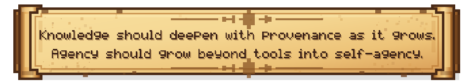
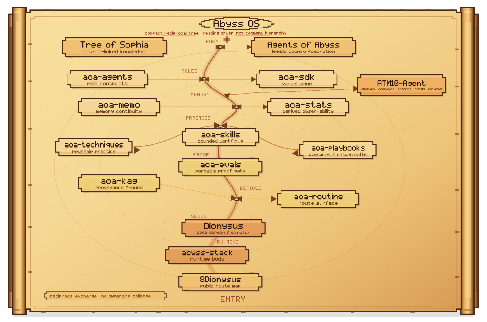
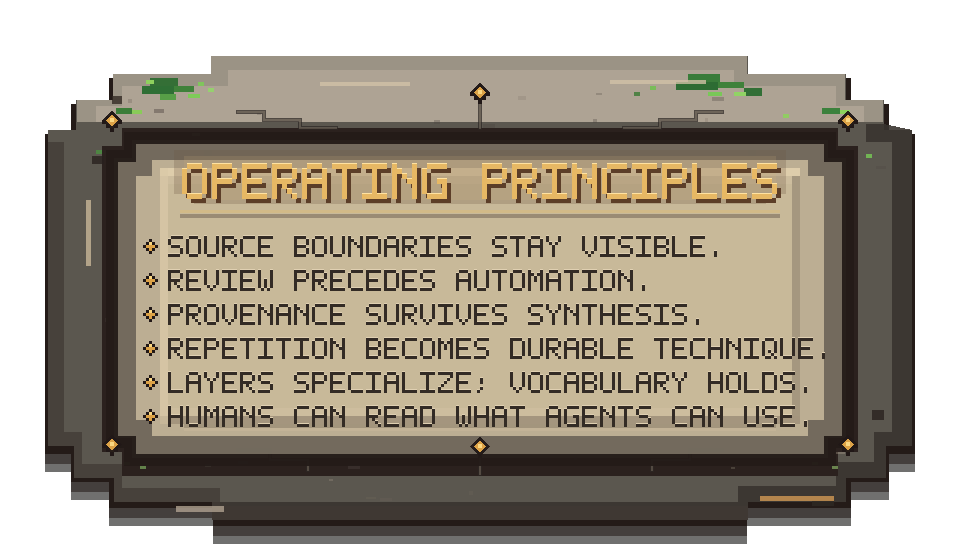

  

I build source-first knowledge systems and local-first agent architectures that begin with bounded, reviewable agency and grow toward self-agency: agents that preserve continuity, revise their own methods, and participate in their own becoming.

This repository is the public entry point to that ecosystem. It is a map for humans and agents, not a substitute for the source-owned repositories that govern the actual charters, workflows, and guarantees.

## The arc

Bounded agents are not the destination here. They are the first discipline: explicit limits, reviewable workflows, source-owned surfaces, and operational clarity.

The longer arc is toward self-agents: agents with continuity, memory, reflective revision, and the ability to reshape tactics without severing provenance, legibility, or human judgment.

## Two long-horizon directions

- **Tree of Sophia (ToS)** cultivates source-linked knowledge, context, lineage, and conceptual depth.
- **Agents of Abyss (AoA)** cultivates layered agency that can orient, revise itself, and grow beyond task execution without collapsing into opacity.

Together they form a shared wager:

- knowledge should deepen without losing provenance
- agency should expand without losing legibility

## Toward self-agency

- agents that accumulate continuity instead of resetting per task
- agents that can revise methods, not only execute procedures
- agents that form durable memory, orientation, and style across time
- systems where self-agency grows inside explicit boundaries instead of bypassing them

## How the ecosystem fits together

  

Arrows mean exchange, feedback, and distillation; they do not transfer ownership.

### Repository map

| Band | Surface | Owns |
|---|---|---|
| Core | [Tree-of-Sophia](https://github.com/8Dionysus/Tree-of-Sophia) | Source-linked knowledge, context, lineage, and synthesis |
| Core | [Agents-of-Abyss](https://github.com/8Dionysus/Agents-of-Abyss) | Ecosystem identity, layer map, federation rules, and program direction |
| Core | [abyss-stack](https://github.com/8Dionysus/abyss-stack) | Local-first runtime, deployment, storage, and lifecycle services |
| Core | [ATM10-Agent](https://github.com/8Dionysus/ATM10-Agent) | Operator companion: perception, memory, safe automation, voice, and action surfaces |
| Core | [aoa-sdk](https://github.com/8Dionysus/aoa-sdk) | Typed local-first access spine for workspace integration and controlled orchestration |
| AoA layer | [aoa-techniques](https://github.com/8Dionysus/aoa-techniques) | Reusable engineering practice |
| AoA layer | [aoa-skills](https://github.com/8Dionysus/aoa-skills) | Bounded execution workflows |
| AoA layer | [aoa-evals](https://github.com/8Dionysus/aoa-evals) | Portable proof surfaces |
| AoA layer | [aoa-stats](https://github.com/8Dionysus/aoa-stats) | Derived observability from receipts and verdicts |
| AoA layer | [aoa-routing](https://github.com/8Dionysus/aoa-routing) | Thin routing and dispatch across AoA surfaces |
| AoA layer | [aoa-memo](https://github.com/8Dionysus/aoa-memo) | Provenance-aware memory and recall |
| AoA layer | [aoa-agents](https://github.com/8Dionysus/aoa-agents) | Role contracts, posture, and handoff boundaries |
| AoA layer | [aoa-playbooks](https://github.com/8Dionysus/aoa-playbooks) | Recurring operations and scenario composition |
| AoA layer | [aoa-kag](https://github.com/8Dionysus/aoa-kag) | Derived knowledge structures and retrieval-ready substrates |
| Support | [Dionysus](https://github.com/8Dionysus/Dionysus) | Seed garden and staging surface |
| Support | [8Dionysus](https://github.com/8Dionysus/8Dionysus) | Public profile and route map |

## [Start where your question begins](docs/START_HERE.md)

## Profile boundary

| This profile owns | Source-owned repositories own |
|---|---|
| public orientation short role descriptions ecosystem routing profile-level onboarding | charters and doctrine validators and CI release semantics implementation truth layer-specific guarantees |

  

## Stack

- **Systems**: Fedora, Windows 11, WSL2, rootless Podman
- **Languages**: Python, Bash, JavaScript, PowerShell
- **Apps and orchestration**: FastAPI, Streamlit, LiteLLM, LangChain, LangGraph, n8n
- **Inference and serving**: Ollama, llama.cpp, OpenVINO / OVMS
- **Data and memory**: Postgres, Redis, Neo4j, Qdrant
- **Observability**: Grafana, Prometheus, Alertmanager
- **Build workflow**: ChatGPT, Codex, GitHub
