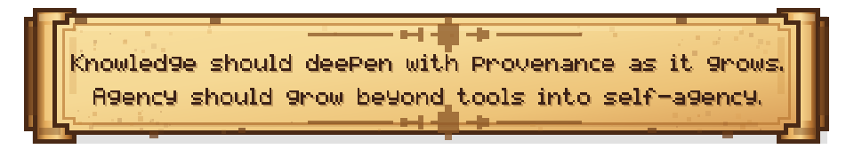
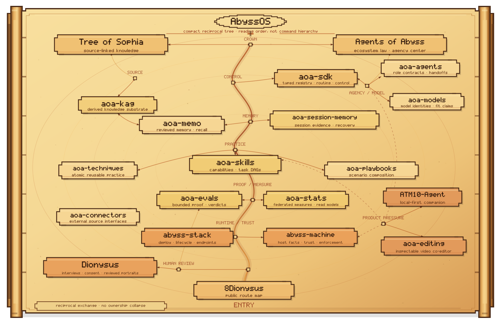
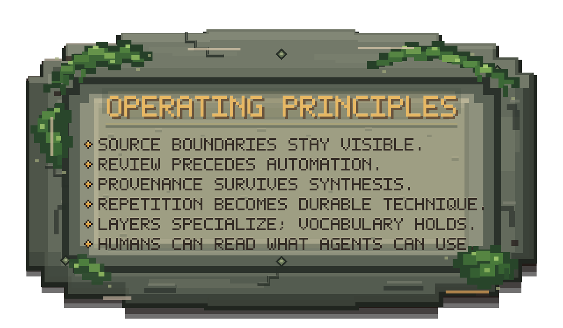

  

I build source-first knowledge systems and local-first agent architectures that begin with bounded, reviewable agency and grow toward self-agency: agents that preserve continuity, revise their own methods, and participate in their own becoming.

This repository is the public entry point to that ecosystem. It is a map for humans and agents, not a substitute for the source-owned repositories that govern the actual charters, workflows, and guarantees.

## The arc

Bounded agents are not the destination here. They are the first discipline: explicit limits, reviewable workflows, source-owned surfaces, and operational clarity.

The longer arc is toward self-agents: agents with continuity, memory, reflective revision, and the ability to reshape tactics without severing provenance, legibility, or human judgment.

## Two long-horizon directions

- [**Tree of Sophia (ToS)**](https://github.com/8Dionysus/Tree-of-Sophia) is a living, source-first architecture for philosophy and world thought. It grows works, witnesses, concepts, contexts, lineages, and reviewed relations into a tree whose branches can return to their roots. Its first golden growth kernel is *Thus Spoke Zarathustra*, carried through five years of reading, listening, recitation, memorization, love, war, death, suffering, and joy.
- **[Agents of Abyss (AoA)](https://github.com/8Dionysus/Agents-of-Abyss)** cultivates layered agency that can orient, revise itself, and grow beyond task execution without collapsing into opacity.

## Toward self-agency

- agents that accumulate continuity instead of resetting per task
- agents that can revise methods, not only execute procedures
- agents that form durable memory, orientation, and style across time
- systems where self-agency grows inside explicit boundaries instead of bypassing them

## How the ecosystem fits together

  

Arrows mean exchange, feedback, and distillation; they do not transfer ownership.

### Repository map

An orientation map, grouped by the pressure each surface owns.

#### Foundations

- **[Tree-of-Sophia](https://github.com/8Dionysus/Tree-of-Sophia)** — source-first philosophical tree of works, concepts, lineages, contexts, and reviewed relations.
- **[Agents-of-Abyss](https://github.com/8Dionysus/Agents-of-Abyss)** — constitutional center for federation identity, ownership boundaries, ecosystem law, and program direction.

#### Agency and control

- **[aoa-sdk](https://github.com/8Dionysus/aoa-sdk)** — typed discovery, compatibility, routing, handoff, and control-plane handles.
- **[aoa-agents](https://github.com/8Dionysus/aoa-agents)** — role and persona contracts, authority limits, and handoff boundaries.
- **[aoa-models](https://github.com/8Dionysus/aoa-models)** — exact model identities and realizations, configuration-scoped claims, lifecycle, and fit projections.

#### Knowledge, intake, and memory

- **[aoa-connectors](https://github.com/8Dionysus?tab=repositories&q=connector)** — policy- and permission-gated external evidence interfaces with local normalization, retrieval, graphs, and source-backed answer packets.
- **[aoa-kag](https://github.com/8Dionysus/aoa-kag)** — source-linked derived knowledge structures and graph-ready or retrieval-ready projections.
- **[aoa-memo](https://github.com/8Dionysus/aoa-memo)** — reviewed, temporal, source-aware durable memory and recall.
- **[aoa-session-memory](https://github.com/8Dionysus/aoa-session-memory)** — evidence-linked preservation, inspection, and recovery of long agent-session history.

#### Practice and proof

- **[aoa-techniques](https://github.com/8Dionysus/aoa-techniques)** — atomic, reusable engineering practices for agents and humans.
- **[aoa-skills](https://github.com/8Dionysus/aoa-skills)** — semantic capability discovery, portable skill bundles, and composition contracts.
- **[aoa-playbooks](https://github.com/8Dionysus/aoa-playbooks)** — recurring scenarios coordinating multiple skills, surfaces, handoffs, and fallbacks.
- **[aoa-evals](https://github.com/8Dionysus/aoa-evals)** — bounded proof surfaces with cases, verdict logic, evidence, and explicit limits.
- **[aoa-stats](https://github.com/8Dionysus/aoa-stats)** — shared statistical grammar, federated owner-local measurement, and deterministic read models.

#### Runtime and products

- **[abyss-stack](https://github.com/8Dionysus/abyss-stack)** — portable runtime infrastructure, deployment, services, storage, lifecycle, and recovery.
- **[abyss-machine](https://github.com/8Dionysus/abyss-machine)** — portable host-machine organ for machine facts, intake, bootstrap, service surfaces, and validation.
- **[ATM10-Agent](https://github.com/8Dionysus/ATM10-Agent)** — installable local-first companion for ATM10 with deterministic perception, memory, planning, and bounded action or voice.
- **[aoa-editing](https://github.com/8Dionysus/aoa-editing)** — inspectable local-first video co-editor with reversible proposals, human review, rendering, QC, and editable export.

#### Human and public entry

- **[Dionysus](https://github.com/8Dionysus/Dionysus)** — open protocols and schemas for evidence-linked, human-reviewed portraits built through interviews over time.
- **[8Dionysus](https://github.com/8Dionysus/8Dionysus)** — public profile, ecosystem route map, profile-level statistics, and workspace-delivery diagnosis.

## [Start where your question begins](docs/START_HERE.md)

## Stack

- **Systems**: Fedora, Windows 11, WSL2, rootless Podman
- **Languages**: Python, Bash, JavaScript, PowerShell
- **Apps and orchestration**: FastAPI, Streamlit, LiteLLM, LangChain, LangGraph, n8n
- **Inference and serving**: Ollama, llama.cpp, OpenVINO / OVMS
- **Data and memory**: Postgres, Redis, Neo4j, Qdrant
- **Observability**: Grafana, Prometheus, Alertmanager
- **Build workflow**: ChatGPT, Codex, GitHub

  

